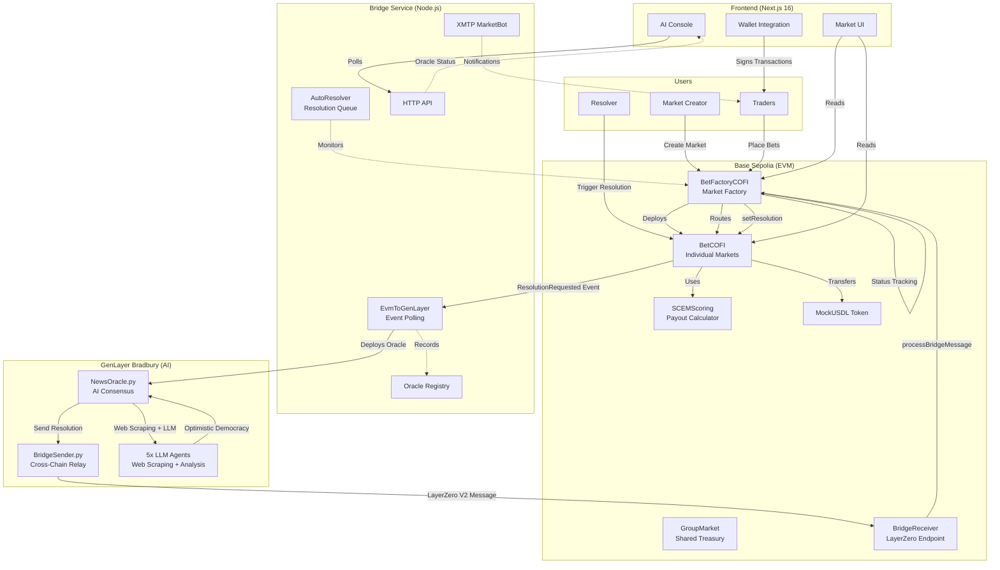
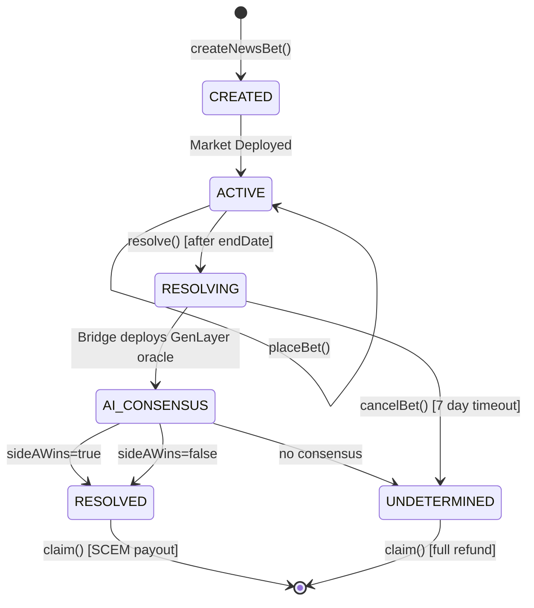
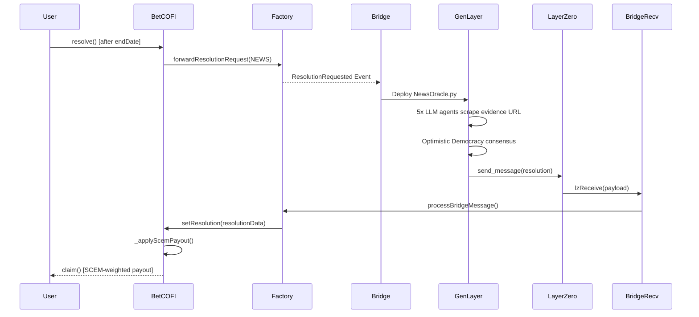
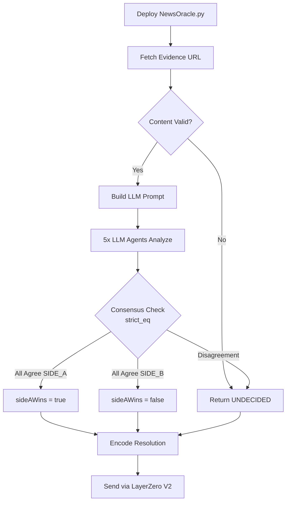
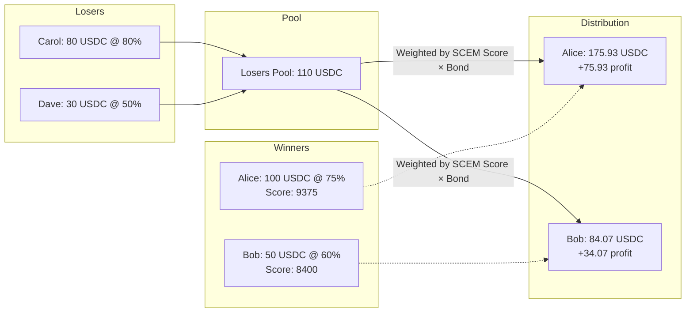

# Gnothi

Decentralized prediction market protocol powered by AI consensus. Markets are resolved by a **decentralized swarm of 5 independent LLM agents** (GenLayer) that scrape real-world data, reach consensus, and bridge results back via LayerZero.

## Tech Stack

| Layer | Technology |
|-------|-----------|
| Smart Contracts | Solidity 0.8.22 (Hardhat) |
| AI Oracle | Python (GenLayer Bradbury Testnet) |
| Cross-Chain Messaging | LayerZero V2 |
| Frontend | Next.js 16 + React 19 + TypeScript |
| Wallet | Privy + Wagmi + Open Wallet Standard |
| Notifications | XMTP (MarketBot agent) |
| Database | Supabase |
| Test Token | MockUSDL (ERC-20) |

## Architecture



## How It Works

### Market Lifecycle



### Resolution Flow



### AI Consensus Process



### SCEM Payout Distribution



Winners receive their bond back plus a share of the losers' pool, weighted by their SCEM score:

```
S(r, q) = 2qr - q²

Where:
  r = realized outcome (100 for correct, 0 for wrong)
  q = predicted probability (1-99)
```

## Project Structure

```
gnothi-ows/
├── contracts/                          # Solidity smart contracts
│   ├── contracts/
│   │   ├── BetFactoryCOFI.sol          # Market factory + resolution routing
│   │   ├── BetCOFI.sol                 # Individual prediction market
│   │   ├── GroupMarket.sol             # Shared treasury for collective bets
│   │   ├── SCEMScoring.sol             # Quadratic scoring rule library
│   │   ├── interfaces/
│   │   └── mocks/                      # MockUSDL test token
│   ├── scripts/                        # Deployment scripts
│   ├── test/                           # Hardhat tests
│   └── hardhat.config.ts
│
├── frontend/                           # Next.js 16 web application
│   ├── src/
│   │   ├── app/                        # App router pages
│   │   │   ├── page.tsx                # Landing page
│   │   │   ├── markets/                # Market listing + detail
│   │   │   ├── admin/                  # Market creation
│   │   │   ├── docs/                   # In-app documentation
│   │   │   └── components/
│   │   │       ├── AIConsole/          # Real-time validator transparency
│   │   │       ├── MarketCard/         # Market preview
│   │   │       ├── MarketDetailPanel/  # Full market view
│   │   │       ├── GroupMarket/        # Group betting panel
│   │   │       ├── OWSWallet/          # Open Wallet Standard panel
│   │   │       └── LandingView/        # Hero + architecture diagrams
│   │   ├── lib/                        # Contract hooks + utilities
│   │   └── types/                      # TypeScript definitions
│   └── package.json
│
├── bridge/
│   ├── service/                        # Node.js relay service
│   │   └── src/
│   │       ├── relay/
│   │       │   ├── EvmToGenLayer.ts    # Base → GenLayer event relay
│   │       │   └── GenLayerToEvm.ts    # GenLayer → Base message relay
│   │       ├── resolution/
│   │       │   ├── AutoResolver.ts     # Automated resolution queue
│   │       │   ├── LoopMarketScheduler.ts
│   │       │   ├── StuckResolvingScanner.ts
│   │       │   ├── ExpiredMarketSweeper.ts
│   │       │   └── OracleRegistry.ts   # Deployment metadata tracking
│   │       ├── xmtp/
│   │       │   └── marketBot.ts        # XMTP notification agent
│   │       ├── ows/
│   │       │   └── OWSVault.ts         # Open Wallet Standard vault
│   │       ├── api/
│   │       │   └── ResolutionAPI.ts    # HTTP API for oracle status
│   │       └── db/
│   │           └── supabase.ts         # Supabase client
│   │
│   ├── intelligent-contracts/          # Python GenLayer contracts
│   │   └── news_pm.py                  # NEWS market oracle (canonical)
│   │
│   └── smart-contracts/                # Bridge smart contracts (zkSync)
│       └── contracts/
│           ├── BridgeReceiver.sol      # LayerZero message receiver
│           └── BridgeForwarder.sol
│
├── supabase/
│   └── migrations/
│       └── 001_initial.sql             # Oracle registry schema
│
└── docs/                               # Documentation
    ├── 01-introduction.md
    ├── 02-architecture.md
    ├── 03-components.md
    ├── 04-news-flow.md
    ├── 05-scem.md
    ├── 06-ai-console.md
    ├── 07-deployment.md
    ├── 08-api.md
    ├── 09-troubleshooting.md
    └── 10-diagrams.md
```

## Quick Start

### Contracts

```bash
cd contracts && npm install
npm run compile              # Compile + sync artifacts
npm run test                 # Run tests
npm run deploy:sepolia       # Deploy to Base Sepolia
```

### Frontend

```bash
cd frontend && npm install
cp .env.example .env.local   # Configure environment
npm run dev                  # Start at localhost:3000
```

### Bridge Service

```bash
cd bridge/service && npm install
cp .env.example .env         # Configure environment
npm run dev                  # Start at localhost:3001
```

## Networks

| Component | Network | Chain ID | LZ EID |
|-----------|---------|----------|--------|
| EVM Contracts | Base Sepolia | 84532 | 40245 |
| GenLayer AI | Bradbury Testnet | 18881 | — |

## Key Features

### AI-Oracle Resolution

Markets resolve through a decentralized swarm of 5 independent LLM agents that:
1. Scrape the evidence URL for real-world data
2. Analyze using fact-checking prompts
3. Reach consensus via Optimistic Democracy (`strict_eq`)
4. Bridge results back via LayerZero V2

### SCEM-Weighted Payouts

Unlike winner-takes-all markets, Gnothi rewards **early and confident** correct predictions using the Quadratic Scoring Rule. Higher SCEM scores earn a larger share of the losers' pool.

### AI Transparency Console

Users can watch resolution in real-time:
- Which URLs validators are scraping
- Individual agent decisions
- Consensus formation progress

### Group Markets

Shared on-chain treasuries enable collective betting where multiple participants pool funds and share outcomes.

### XMTP Notifications

MarketBot agent autonomously notifies users on market events and validator votes via XMTP.

### Open Wallet Standard (OWS)

Reputation-gated agent wallets via the Open Wallet Standard for autonomous agent participation.

## Documentation

Full documentation is available in the [`docs/`](./docs/) directory:

| Document | Content |
|----------|---------|
| [Introduction](./docs/01-introduction.md) | Oracle problem, Gnothi solution |
| [Architecture](./docs/02-architecture.md) | System design, data flow diagrams |
| [Components](./docs/03-components.md) | Contract and service details |
| [NEWS Flow](./docs/04-news-flow.md) | End-to-end market walkthrough |
| [SCEM](./docs/05-scem.md) | Scoring mathematics |
| [AI Console](./docs/06-ai-console.md) | Validator transparency |
| [Deployment](./docs/07-deployment.md) | Step-by-step deployment |
| [API](./docs/08-api.md) | Bridge service HTTP API |
| [Troubleshooting](./docs/09-troubleshooting.md) | Common issues |
| [Diagrams](./docs/10-diagrams.md) | Visual diagrams |

## License

MIT — see [LICENSE](./LICENSE) for details.
